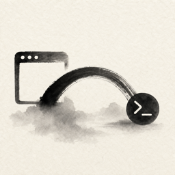
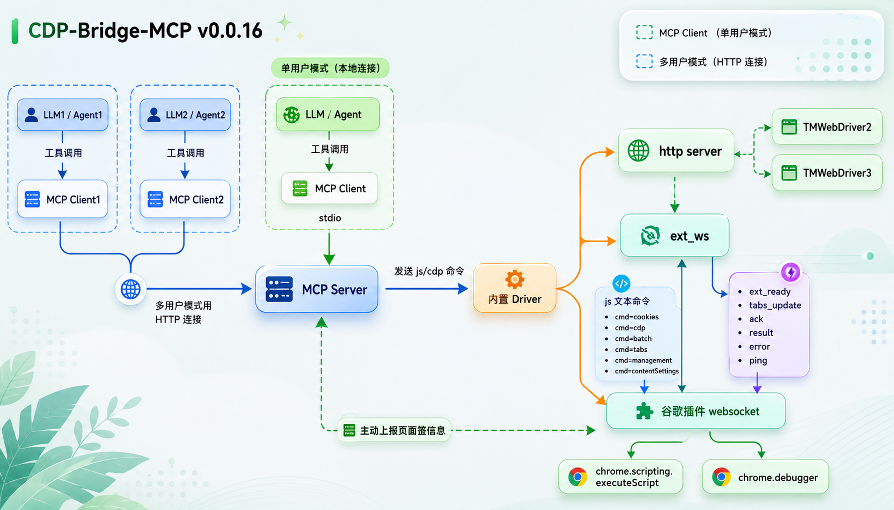
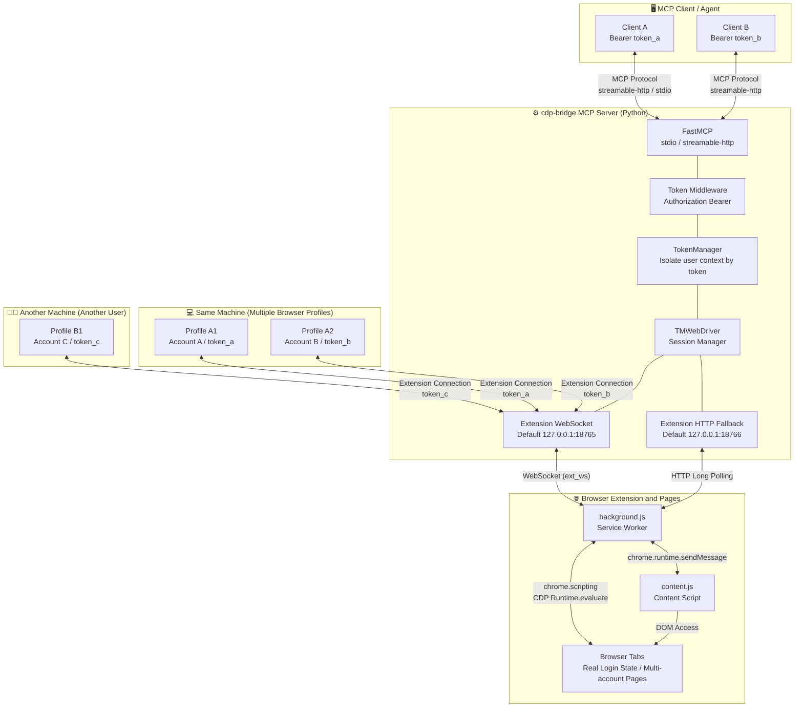
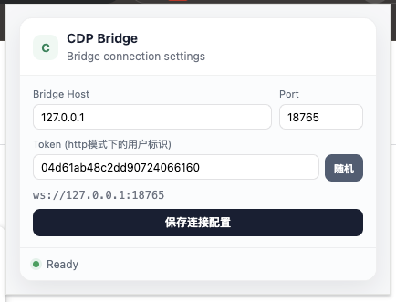

<p align="center">
  
</p>

<h1 align="center">CDP Bridge MCP</h1>

<div align="center">

[](https://pypi.org/project/cdp-bridge/)
[](https://www.python.org/)
[](https://modelcontextprotocol.io/)
[](https://github.com/Unagi-cq/cdp-bridge-mcp)

</div>

<p align="center">
CDP Bridge MCP is a bridge service that connects MCP clients to real browser sessions. Through the bundled Chromium extension, it lets any LLM client seamlessly read tabs, scan pages, perform automation, take screenshots, and navigate.
</p>

<p align="center">
中文 | <a href="./doc/README_EN.md">English</a>
</p>

# Demo Videos

| Operating Multiple Xiaohongshu Accounts Simultaneously on One PC | Querying Latest Anthropic News on Xiaohongshu Platform | Reading Author Dashboard Analytics on CSDN |
|-----------------------------------------------------|----------------------------------------------------------|----------------------------------------------------------|
| [Watch Video](https://www.bilibili.com/video/BV1RDRQBrEY7) | [Watch Video](https://www.bilibili.com/video/BV1RDRQBrEY7/?p=3) | [Watch Video](https://www.bilibili.com/video/BV1RDRQBrEY7/?p=2) |

# Project Overview

CDP Bridge MCP is ideal for scenarios where you need an LLM to interact with a real browser. **Unlike stateless HTTP scraping, it connects to browser pages you have already logged into, so it can reuse real browser login states, cookies, page state, and front-end rendered results.**

CDP Bridge MCP also supports multi-Profile operation on a single machine and multi-user operation.

Repository: <https://github.com/Unagi-cq/cdp-bridge-mcp>

> This project is written and published in Python. MCP supports both `stdio` and `streamable-http` transport modes.

# Key Advantages

**Why use CDP Bridge MCP instead of Playwright MCP, Kimi Bridge, or Chrome DevTools MCP?**

Playwright MCP and Chrome DevTools MCP are both powerful, but they lean more toward "automated testing / debugging protocol / new browser instance" workflows. Kimi Bridge has limited permissions and tends to accomplish tasks by sending screenshots to a visual model.

CDP Bridge MCP has a different goal: it focuses on letting LLMs or Agent products take over the real browser session the user is currently using.

- **Reuse real login states**: CDP Bridge MCP connects to browser tabs you have already opened and logged into. Many websites requiring account state do not need re-login or additional cookie handling.
- **Better suited for daily browser collaboration**: Playwright is better for repeatable, scriptable automation flows, while CDP Bridge MCP is better suited for LLMs to perform interactive tasks on the user's current page: reading, analyzing, pre-click judgment, script execution, screenshots, etc.
- **Page content is more LLM-friendly**: `browser_scan` simplifies page HTML, filtering scripts, styles, and invisible elements while preserving content, controls, and structural information useful to the model, reducing token waste.
- **Lightweight startup chain**: After the server is published to PyPI, it can be started directly with `uvx cdp-bridge`. The browser side only needs to load the extension to connect — no need to write Playwright scripts or configure debugging parameters for each browser instance.
- **Suitable for remote deployment and Agent product development**: If using `streamable-http` mode, `cdp-bridge` can be deployed as a persistent service on a remote server. The Agent backend connects to the service via the MCP HTTP endpoint, while the extension in the user's browser connects to the same service via WebSocket. This way, the product side does not need to host the user's browser or move account state to the cloud; users only need to install the extension and configure `Bridge Host`, `Port`, and `Token`, and the Agent can complete reading, analysis, and automation operations within the user's authorized real browser session.
- **Supports parallel connection of multiple browser Profiles on the same machine**: If you open multiple Chrome/Chromium Profiles on the same machine and configure different tokens for the extension for each, the server will isolate them into different session spaces. This means you can have multiple accounts logged into the same platform simultaneously, with Agents operating each account's real browser pages separately.
- **Supports simultaneous multi-user access from different machines**: Browser extensions on different machines and different users can all connect to the same `streamable-http` service, working in parallel without interference as long as each uses a different token. Suitable for customer service agents, operations teams, data collection nodes, or remote collaboration scenarios.
- **Covers both personal use and team products**: Individual users can quickly connect to a local browser with default `stdio + 127.0.0.1:18765`; teams or product developers can use `streamable-http + remote domain + WebSocket + token` to build a browser control channel, integrating real browser capabilities into their Agent products, customer service workbenches, data collection backends, or internal automation systems.

Therefore, if your goal is "let the model control a specifically launched automation browser," Playwright MCP is suitable; if your goal is "debug Chrome or finely control the DevTools protocol," Chrome DevTools MCP is suitable; if your goal is "let the model or Agent product read and operate the real browser page the user is currently using," CDP Bridge MCP is closer to this scenario.

## System Architecture

<p align="center">
  
</p>



**Data Flow Overview:**

1. MCP clients connect to the `cdp-bridge` service via **stdio** (child process) or **streamable-http** (HTTP endpoint); in `streamable-http` mode, clients can specify their user context via `Authorization: Bearer <token>`.
2. The server's `Token Middleware` extracts the token, and `TokenManager` isolates sessions by token; MCP requests and browser extension connections under the same token are routed to the same context.
3. TMWebDriver starts a WebSocket (default :18765) and internal HTTP fallback (default :18766) for the browser extension to connect to; users on different machines or extensions for different Browser Profiles on the same machine can all connect simultaneously.
4. Each browser extension reports its token and open tabs when connecting (`ext_ws` mode); based on this, the server isolates real browser pages for different profiles, accounts, and users.
5. When an MCP tool is invoked (e.g., `browser_execute_js`), the server only sends the JS code to the browser session corresponding to the current token; the extension's background.js preferentially uses `chrome.scripting.executeScript` to execute in the page's MAIN world. If the page has CSP restrictions, it automatically falls back to CDP `Runtime.evaluate`.
6. Execution results are returned to the server via WebSocket, then returned to the corresponding client via the MCP protocol; therefore, multiple accounts on the same platform can be operated simultaneously, and multiple users on multiple machines can use it concurrently without interference.

## Available Tools

The MCP service currently exposes the following 10 tools:

| Tool Name | Parameters | Description |
| --- | --- | --- |
| `browser_get_tabs` | None | Gets all connected browser tabs, returning tab ID, URL, and title lists, plus the currently active tab |
| `browser_scan` | `tabs_only` (bool), `switch_tab_id` (str), `text_only` (bool) | Scans the active tab's content. `tabs_only` returns only the tab list to save tokens; `text_only` returns plain text instead of simplified HTML; `switch_tab_id` switches to the specified tab before scanning |
| `browser_execute_js` | `script` (str, required), `switch_tab_id` (str), `no_monitor` (bool) | Executes JavaScript in the browser and captures return values and DOM change diffs. `no_monitor` skips DOM monitoring for faster execution; `switch_tab_id` switches to the target tab first before executing |
| `browser_switch_tab` | `tab_id` (str, required) | Switches the active tab on the MCP side (does not change the tab visible to the user in Chrome); subsequent tool calls will act on this tab |
| `browser_focus_tab` | `tab_id` (str, required) | Brings the Chrome tab to the foreground and focuses the window, making the tab visible to the user. Unlike `browser_switch_tab` (which only switches the MCP-side session), this tool actually activates the Chrome window and tab |
| `browser_batch` | `commands` (list[dict], required), `tab_id` (str), `timeout` (float) | Batch executes multiple extension/CDP commands in a single request, suitable for complex operation chains that need to reuse CDP context |
| `browser_wait` | `condition_js` (str, required), `timeout` (float), `interval` (float), `switch_tab_id` (str) | Polls and waits for a JavaScript conditional expression to return true. `timeout` is the maximum wait time in seconds (default: 10); `interval` is the check interval in seconds (default: 0.5) |
| `browser_navigate` | `url` (str, required) | Navigates the active tab to the specified URL |
| `browser_screenshot` | `tab_id` (str) | Takes a screenshot of the active tab, returning base64-encoded PNG image data |
| `browser_save_image` | `screenshot_json_str_or_file` (str, required), `output_path` (str) | Saves the base64 screenshot data returned by `browser_screenshot` as a local PNG file. `screenshot_json_str_or_file` is the screenshot JSON string or JSON file path; `output_path` is the output path or directory |

# Quick Start

Here is the fastest usage process with default configuration:

1. Install `uv`.
2. Open `chrome://extensions/` in Chrome or other Chromium browser, enable "Developer Mode".
3. Click "Load unpacked extension" and select the `src/cdp_bridge/tmwd_cdp_bridge` folder.
4. Add `cdp-bridge` in your MCP client.

Configure MCP in any client:

```json
{
  "mcpServers": {
    "cdp-bridge": {
      "command": "uvx",
      "args": ["cdp-bridge@latest"]
    }
  }
}
```

After configuration, open any page in your browser and let the model perform web operations in your LLM client. The extension will automatically connect to the WebSocket service started by the MCP process; if you see `ERR_CONNECTION_REFUSED` for the first time, wait a few seconds and it will reconnect automatically.

# Detailed Usage

## Installation Steps

1. Load the browser extension `src/cdp_bridge/tmwd_cdp_bridge` folder provided in the project into Chrome or other Chromium browser.
2. Configure CDP Bridge MCP in your MCP client.

Then you can use it normally. Below is a detailed introduction to the installation steps above.

> **First-time use**: The first WebSocket connection after loading the extension will produce an `ERR_CONNECTION_REFUSED` error, which is normal. The extension has a built-in automatic reconnection mechanism (~5 seconds detection interval). When the backend service starts, the connection will automatically restore. No manual extension restart is needed.

## Usage Flow

1. **Load the browser extension** (see steps below)
2. **Configure the MCP client** (see steps below)
3. **Use any browser tool** (such as `browser_get_tabs`). The WebSocket service will be ready automatically when the MCP service starts.
4. The browser extension will connect automatically within a few seconds. After that, all tools are ready to use.

## Loading the Browser

Load in Chrome or other Chromium browser:

1. Open `chrome://extensions/`.
2. Enable "Developer Mode".
3. Click "Load unpacked extension".
4. Select the `src/cdp_bridge/tmwd_cdp_bridge` folder.

By default, the extension connects to the local WebSocket service `127.0.0.1:18765`.

You can modify the connection configuration in the extension popup:

<p align="center">
  
</p>

- `Bridge Host`: Can be `127.0.0.1`, `localhost`, or a domain name. When using a domain name, the port can be omitted, e.g., `bridge.example.com`.
- `Port`: WebSocket port. With local default configuration, it is `18765`; if `--ws-port` was used when starting MCP, enter the same port here. When connecting via domain name and the service uses the default WebSocket port, this can be left empty.
- `Token`: In `streamable-http` multi-user mode, this binds the browser extension and MCP client to the same user context. If left empty, the extension will automatically use the default value `__default__`. If you use a Bearer token to access a remote MCP service, this must exactly match the token on the client side.

## Configure MCP

First, make sure `uv` is installed on your machine. CDP Bridge MCP starts via `uvx cdp-bridge@latest`.

### Two Transport Modes

CDP Bridge supports two MCP transport modes. Choose based on your use case:

| Mode | Principle | Applicable Scenarios |
|------|------|----------|
| `stdio` (default) | MCP client starts the service as a subprocess, communicating via stdin/stdout | Claude Desktop, Claude Code, Codex and other local clients |
| `streamable-http` | Service runs as an independent HTTP process, client connects via HTTP requests | Multi-client sharing, Docker deployment, persistent service |

### Startup Parameters

| Parameter | Default | Applicable Mode | Description |
| --- | --- | --- | --- |
| `--transport` | `stdio` | Both modes | MCP transport mode. Options: `stdio` or `streamable-http`. |
| `--ws-port` | `18765` | Both modes | WebSocket port for browser extension connection. Configurable regardless of whether `stdio` or `streamable-http` is used. |
| `--port` | `8000` | `streamable-http` only | MCP HTTP service port. Only used when `--transport streamable-http`. Client connection address is `http://127.0.0.1:<port>/mcp`. |
| `--tokens` | Empty | `streamable-http` only | Allowed token whitelist for access, multiple tokens separated by English commas; when empty, accepts any token. |
| --host | 127.0.0.1 | `streamable-http` only | By default, `streamable-http` listens on 127.0.0.1, which does not allow remote access. Adding this parameter specifies the listening IP, which can be set to 0.0.0.0 to listen on all network interfaces. |

Note: `--ws-port` is the port for the browser extension to connect to the backend; `--port` is the port for the MCP client to connect to the backend. They are not the same port.

### Test Commands

```bash
# stdio mode (default)
uvx cdp-bridge@latest

# stdio mode, specify WebSocket port
uvx cdp-bridge@latest --ws-port 18767

# streamable-http mode, specify MCP HTTP port
uvx cdp-bridge@latest --transport streamable-http --port 8000

# streamable-http mode, specify both MCP HTTP port and browser extension WebSocket port
uvx cdp-bridge@latest --transport streamable-http --port 8000 --ws-port 18767

# streamable-http mode, only allow specific tokens to connect
uvx cdp-bridge@latest --transport streamable-http --port 8000 --tokens "team_alice,team_bob"

# streamable-http mode, specify both MCP HTTP port and listening IP; remote machines can access the running MCP Server via 172.25.240.1:8000
uvx cdp-bridge@latest --transport streamable-http --host 172.25.240.1 --port 8000

# Token whitelist can also be passed via environment variable
CDP_BRIDGE_TOKENS="team_alice,team_bob" uvx cdp-bridge@latest --transport streamable-http --port 8000
```

When `--transport` is not passed, `stdio` is used by default. `stdio` mode has no MCP HTTP port; `streamable-http` mode's MCP service address is `http://127.0.0.1:<port>/mcp`.

### Token and Multi-User Isolation

In `streamable-http` mode, the server isolates browser session spaces by token.

- MCP clients pass the token via HTTP header: `Authorization: Bearer <token>`
- Browser extensions pass the same token via the `Token` field in the popup
- **Client token and extension token must exactly match** so the server can route them to the same user context
- If no token is filled in the extension, it automatically uses the default value `__default__`
- If the server does not have `--tokens` configured, any token can connect; after configuring `--tokens`, only whitelisted tokens are allowed
- On the **same machine**, you can use different tokens for different browser Profiles to operate multiple accounts on the same platform in parallel
- On **different machines**, you can also have multiple users connect to the same `streamable-http` service and achieve isolation through different tokens

### Standard Configurations

**stdio mode:**

```json
{
  "mcpServers": {
    "cdp-bridge": {
      "command": "uvx",
      "args": ["cdp-bridge@latest"]
    }
  }
}
```

If you need to modify the WebSocket port for the browser extension connection, add `--ws-port` to `args`:

```json
{
  "mcpServers": {
    "cdp-bridge": {
      "command": "uvx",
      "args": ["cdp-bridge@latest", "--ws-port", "18767"]
    }
  }
}
```

**streamable-http mode:**

First start the service:
```bash
uvx cdp-bridge@latest --transport streamable-http --port 8000
```

If you also need to modify the WebSocket port for the browser extension:
```bash
uvx cdp-bridge@latest --transport streamable-http --port 8000 --ws-port 18767
```

Then configure the client to connect:
```json
{
  "mcpServers": {
    "cdp-bridge": {
      "type": "streamableHttp",
      "url": "http://127.0.0.1:8000/mcp"
    }
  }
}
```

If you enabled multi-user isolation, the client should explicitly carry the Bearer token:
```json
{
  "mcpServers": {
    "cdp-bridge": {
      "type": "streamableHttp",
      "url": "http://127.0.0.1:8000/mcp",
      "headers": {
        "Authorization": "Bearer team_alice"
      }
    }
  }
}
```

At this point, the `Token` in the browser extension popup should also be filled in as `team_alice`.

### Claude Code

**Method 1: Command Line**

```bash
# stdio mode
claude mcp add cdp-bridge uvx cdp-bridge@latest

# streamable-http mode (start service first, then register)
claude mcp add cdp-bridge --transport streamable-http http://127.0.0.1:8000/mcp
```

**Method 2: Configuration File (recommended for streamable-http mode)**

Add `mcpServers` config in `~/.claude.json`:

```json
{
  "mcpServers": {
    "cdp-bridge": {
      "type": "http",
      "url": "http://127.0.0.1:8000/mcp"
    }
  }
}
```

> Note: When using the configuration file method, you need to start the `cdp-bridge` service first (`uvx cdp-bridge@latest --transport streamable-http --port 8000 --ws-port 18765`), then restart Claude Code.

### Codex

```bash
# stdio mode
codex mcp add cdp-bridge uvx cdp-bridge@latest

# streamable-http mode
codex mcp add cdp-bridge --transport streamable-http --url http://127.0.0.1:8000/mcp
```

### opencode

Configure in `~/.config/opencode/opencode.json`:

**stdio mode:**
```json
{
  "$schema": "https://opencode.ai/config.json",
  "mcp": {
    "cdp-bridge": {
      "type": "local",
      "command": [
        "uvx",
        "cdp-bridge@latest"
      ],
      "enabled": true
    }
  }
}
```

**streamable-http mode:**
```json
{
  "$schema": "https://opencode.ai/config.json",
  "mcp": {
    "cdp-bridge": {
      "type": "remote",
      "url": "http://127.0.0.1:8000/mcp",
      "enabled": true
    }
  }
}
```

### OpenClaw

You can use the OpenClaw CLI to write MCP configuration:

```bash
# stdio mode
openclaw mcp set cdp-bridge '{"command":"uvx","args":["cdp-bridge@latest"]}'

# streamable-http mode
openclaw mcp set cdp-bridge '{"transport":"streamable-http","url":"http://remoteip:8000/mcp"}'
```

Equivalent stdio config structure:
```json
{
  "mcp": {
    "servers": {
      "cdp-bridge": {
        "command": "uvx",
        "args": ["cdp-bridge@latest"]
      }
    }
  }
}
```

### Notes

- This project requires Python 3.10 or higher.
- The browser extension has a built-in automatic reconnection mechanism: after the first connection failure, it will continuously probe the WebSocket service (~5 seconds). When the MCP service starts, the connection will automatically restore. If you see ERR_CONNECTION_REFUSED, wait a few seconds and it will recover automatically.
- Page automation runs in your real browser session. Only connect to MCP clients you trust.

## Acknowledgements

The browser extension and some code in this project are referenced and derived from [GenericAgent](https://github.com/lsdefine/GenericAgent). Thanks to the original project author for their open-source work.